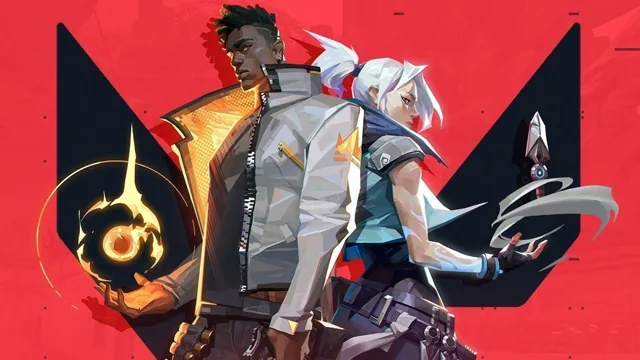
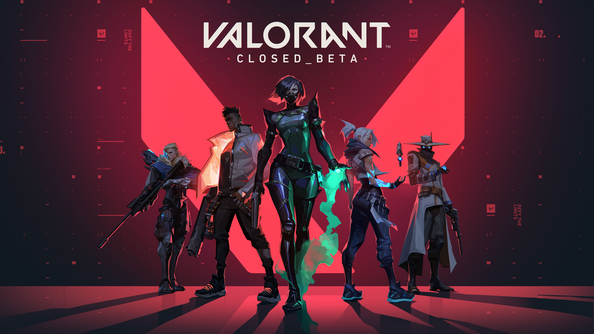

# Parche 5.08: qué ha cambiado

Hoy repasamos las novedades introducidas en el parche 5.08 de Valorant: ajustes de agentes, pequeños cambios en mapas y correcciones de errores.

## Puntos destacados

- Ajustes en el equilibrio de agentes: se han afinado daños y cooldowns en varios personajes para mejorar la experiencia competitiva.
- Correcciones de bugs en efectos visuales que podían causar confusión en partidas de alto nivel.
- Mejoras en la estabilidad de servidores para reducir picos de latencia en determinadas regiones.

Para la lista completa de cambios, consulta las notas oficiales del parche:

[Notas oficiales de Valorant - Noticias](https://playvalorant.com)

## Recomendaciones rápidas

- Si eres jugador competitivo, presta atención a los cambios de tu agente principal: puede ser necesario adaptar el estilo de juego.
- Actualiza tu cliente antes de jugar para asegurarte de recibir las correcciones de rendimiento.

¿Quieres que analice en detalle algún ajuste de agente concreto? Dime cuál y preparo un post dedicado.

***

***Publicado: 12 de noviembre de 2025***
