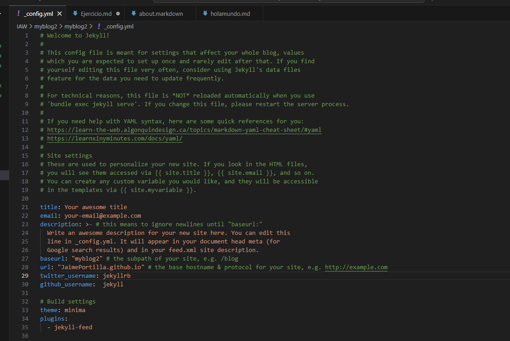

# EJERCICIO 1 - Crear un sitio Jekyll en GitHub Pages

Crear un documento que describa en **Markdown** todos los pasos necesarios para desplegar el tema de Jekyll **"minima"** en GitHub Pages. 

El proceso debe realizarse inicialmente en un servidor local en **Debian 13** y posteriormente desplegarse en **GitHub Pages**.

### 1. Instalación de Jekyll

Deberás instalar **Jekyll** y crear una configuración adecuada en tu sitio Jekyll. Para la configuración, deberás modificar los pares clave/valor de los archivos `.yml`, en este caso, el archivo:

### 2. Temas de Jekyll disponibles

Recuerda que existen temas de Jekyll que contienen archivos `.yml` almacenados en el directorio `_data` también para su configuración. 

**Nota importante:** Este no es el caso del tema "minima".

---

## Pasos de configuración

### 3. Personalización del sitio

Para la documentación del sitio deberás personalizar algunas páginas que vienen por defecto:

- `index.markdown`
- `about.markdown`
- `_config.yml` (configuración general)

Deberás crear al menos **una nueva página** (page) e incorporar al menos **3 publicaciones** (posts).

Puedes copiar las páginas por ejemplo desde `index.markdown` y los posts (por ejemplo: `xxxx-xx-xx-welcome-to-jekyllmarkdown`) que vienen en el tema por defecto para crear la/s nueva/s página/s y los posts.

---

## Temática del blog

La temática del blog es **libre**, pero es muy importante que sea una temática **CON SENTIDO**. Por ejemplo:

- Alguna institución pública o privada
- Una asociación de vecinos
- Un coleccionista
- Un profesor
- Un empresario
- Una página personal en general
- Una afición, etc.

Es muy importante que el blog esté configurado de manera que aparezca tu nombre y apellidos como autor. Se valorará la inclusión de alguna imagen en las páginas y los posts (o publicaciones).

---
